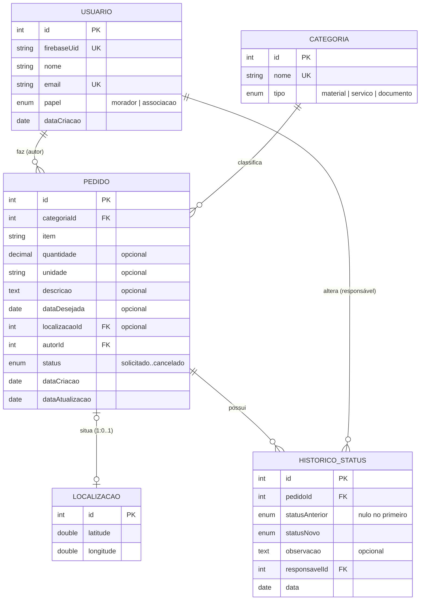

# Entidades do backend

Base do modelo de dados do Mutirão, com TypeORM. As regras de negócio de cada entidade estão em `docs/dominio.md` (na branch de documentação) e o contrato das rotas em `docs/contrato-api.md`.

## Relacionamentos



| Entidade | Arquivo | Tabela |
| --- | --- | --- |
| Usuario | `src/usuarios/usuario.entity.ts` | `usuarios` |
| Categoria | `src/categorias/categoria.entity.ts` | `categorias` |
| Localizacao | `src/pedidos/localizacao.entity.ts` | `localizacoes` |
| Pedido | `src/pedidos/pedido.entity.ts` | `pedidos` |
| HistoricoStatus | `src/pedidos/historico-status.entity.ts` | `historico_status` |

## Comportamento ao apagar

| Relação | Ao apagar o lado "um" |
| --- | --- |
| Categoria → Pedido | Bloqueia (`RESTRICT`): categoria com pedidos não pode ser apagada |
| Usuario → Pedido | Bloqueia (`RESTRICT`) |
| Usuario → HistoricoStatus | Bloqueia (`RESTRICT`) |
| Pedido → HistoricoStatus | Apaga junto (`CASCADE`) |

Na prática pedidos não são apagados; o cancelamento é uma mudança de status.

## Banco de dados

O banco ainda não foi definido (candidato: Supabase/Postgres). Por isso a conexão é opcional:

- Sem `DATABASE_URL`, a API sobe normalmente, sem banco.
- Com `DATABASE_URL`, o `DatabaseModule` conecta ao Postgres e registra as entidades.

Copie `.env.example` para `.env` e preencha. Em desenvolvimento, `DB_SYNC=true` cria as tabelas a partir das entidades. Em produção use migrations.

```bash
node --env-file=.env dist/main.js
```

## Testes

`src/database/entidades.spec.ts` monta o modelo sem conectar a nenhum banco e confere tabelas, relações, obrigatoriedade dos campos, enums e a exclusão em cascata do histórico.

```bash
npm run test -w backend
```

## Observações para quem continuar

- As entidades usam `Relation<T>` nas propriedades de relação. Isso evita erro de importação circular em ESM, porque `Pedido`, `Usuario` e `HistoricoStatus` se referenciam.
- Os enums usam `simple-enum`, que funciona em qualquer banco e guarda o valor como texto.
- As regras de negócio (campos obrigatórios por tipo de pedido, transições de status e permissões) ficam nos serviços, não nas entidades.
