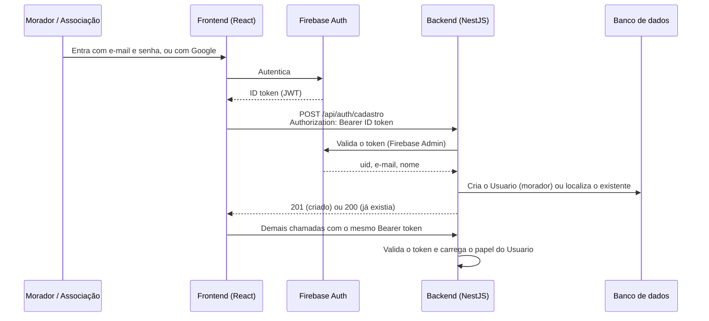

# Decisões técnicas

Decididas por Marcos Gomes (T.I. da Associação). ⚠️ Confirmar com a Larissa e com o professor onde indicado.

| Tema | Decisão | Observação |
| --- | --- | --- |
| Frontend | React com TypeScript | Responsável: Larissa |
| Backend | NestJS com TypeScript | Responsável: Marcos. Valida o token do Firebase e aplica as regras de negócio e de permissão |
| Login | **Firebase Auth**, com e-mail e senha e com Google | O sistema não guarda senhas. O frontend envia o ID token em `Authorization: Bearer` |
| Banco de dados | **A definir** (candidato: Supabase/PostgreSQL) | ⚠️ O canvas cita PostgreSQL; confirmar com o professor se outro banco é aceito |
| Hospedagem | PaaS gratuita | R$ 0 durante o desenvolvimento |

## Papéis

- Todo usuário novo entra como `morador`.
- O papel `associacao` é atribuído pela administração (T.I. da Associação), diretamente no banco ou por configuração.

## Fluxo de autenticação

O login é feito no **Firebase Auth**, com e-mail e senha ou com Google. O backend nunca recebe a senha: ele só confere o token que o Firebase emitiu.

1. O usuário entra pelo frontend, com o Firebase SDK. Não existe rota de login nem de logout na API.
2. O Firebase devolve um **ID token**. O SDK o renova sozinho antes de expirar.
3. O frontend envia o token em `Authorization: Bearer <idToken>` em todas as chamadas.
4. No primeiro acesso, o frontend chama `POST /api/auth/cadastro`. O backend cria o `Usuario` com papel `morador`; nos acessos seguintes, apenas devolve o existente (sem duplicar, pois `firebaseUid` e `email` são únicos).
5. O backend valida o token a cada requisição. Token ausente, inválido ou expirado retorna `401`.
6. O **papel** (`morador` ou `associacao`) fica no banco, no `Usuario`, e não no token. Quem promove um usuário a `associacao` é a administração (T.I. da Associação).
7. Logout é feito no Firebase, pelo frontend.

### O que falta configurar (pendente)

| Item | Quem | Onde |
| --- | --- | --- |
| Criar o projeto no Firebase | Marcos | Console do Firebase |
| Ativar os provedores **E-mail/senha** e **Google** | Marcos | Firebase → Authentication → Sign-in method |
| Cadastrar os domínios do site (local e publicado) como autorizados | Marcos | Firebase → Authentication → Settings |
| Passar a configuração web do app (`apiKey`, `projectId` etc.) ao frontend | Marcos → Larissa | Variáveis de ambiente do frontend |
| Gerar a chave da conta de serviço para o backend | Marcos | Firebase → Configurações do projeto → Contas de serviço |

**Segurança:** a chave da conta de serviço é um segredo. Ela fica só em variável de ambiente (`.env`, que o Git ignora) e **nunca** deve ser commitada nem enviada em issue, PR ou chat. A configuração web do frontend não é secreta, mas também fica em variáveis de ambiente.

## Por que o frontend não fala direto com o banco

As regras de status, as transições permitidas e as permissões por papel ficam no backend, em um só lugar, seguindo o [contrato da API](contrato-api.md).
