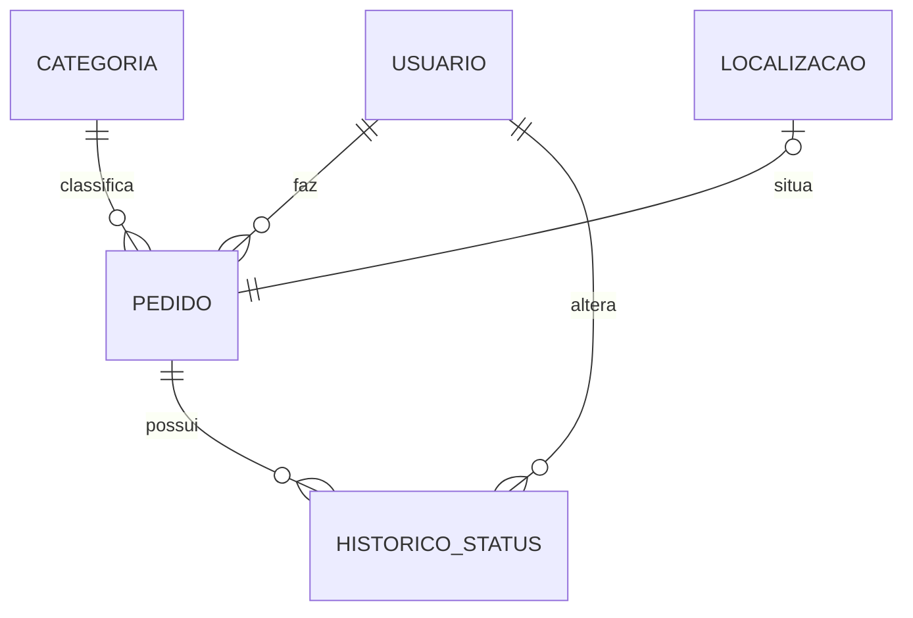

# Domínio do Mutirão

Entidades do MVP, seus atributos, relações e regras principais. Os nomes dos campos seguem o [contrato da API](contrato-api.md).

O Mutirão registra **pedidos** que moradores e agricultores familiares fazem à Associação. Há três tipos de pedido:

- **Material:** sementes, adubo, ferramentas e outros itens. A Associação aprova ou nega.
- **Serviço de máquina:** trator e patrol (rodagem de estrada). O serviço é da Prefeitura; a Associação **encaminha** o pedido e registra o andamento. O sistema não se integra à Prefeitura.
- **Documento:** declarações que a Associação emite (ex.: de morador/residência e de convivência). A Associação aprova, emite o documento (assinado pelo presidente) e o marca como atendido quando entregue. ⚠️ Confirmar quais declarações existem.

## Diagrama de relações

## Usuario

Pessoa que acessa o sistema: morador/agricultor ou membro da Associação.

| Atributo | Tipo | Obrigatório | Observação |
| --- | --- | :---: | --- |
| id | inteiro | sim | gerado |
| nome | texto | sim | |
| email | texto | sim | único |
| firebaseUid | texto | sim | único; identificador do usuário no Firebase Auth |
| papel | `morador` \| `associacao` | sim | padrão `morador` |
| dataCriacao | data/hora | sim | gerado |

**Regras**
- A autenticação é feita pelo **Firebase Auth** (e-mail e senha, ou Google). O sistema não guarda nem recebe senhas.
- O registro de `Usuario` é criado no primeiro acesso, a partir do token do Firebase (`firebaseUid`, `email`, `nome`). O e-mail e o `firebaseUid` são únicos.
- Todo usuário novo é `morador`. O papel `associacao` é atribuído pela administração (T.I. da Associação).

## Categoria

Tipo de pedido. Define se o pedido é de material, de serviço de máquina ou de documento.

| Atributo | Tipo | Obrigatório | Observação |
| --- | --- | :---: | --- |
| id | inteiro | sim | gerado |
| nome | texto | sim | único |
| tipo | `material` \| `servico` \| `documento` | sim | define as regras de preenchimento do pedido |

**Regras**
- Lista fixa carregada por seed (sugestão, a confirmar com a Associação):

| Nome | Tipo |
| --- | --- |
| Sementes | material |
| Adubo | material |
| Ferramentas | material |
| Serviço de trator | servico |
| Serviço de patrol | servico |
| Declaração | documento |
| Outros | material |

- Na Etapa 1 não há CRUD de categorias.

## Localizacao

Ponto geográfico da propriedade ou do trecho onde o serviço será feito.

| Atributo | Tipo | Obrigatório | Observação |
| --- | --- | :---: | --- |
| latitude | decimal | sim | entre -90 e 90 |
| longitude | decimal | sim | entre -180 e 180 |

**Regras**
- Objeto de valor: pertence a um único pedido (relação 1:1) e é salvo junto com ele, sem rota própria.
- **Obrigatória** em pedidos de `servico` (a Prefeitura precisa saber onde ir). **Opcional** em pedidos de `material`.

## Pedido

Solicitação de um morador ou agricultor à Associação.

| Atributo | Tipo | Obrigatório | Observação |
| --- | --- | :---: | --- |
| id | inteiro | sim | gerado |
| categoriaId | referência | sim | → Categoria |
| item | texto | sim | o que está sendo pedido (ex.: "Semente de milho", "Rodagem do ramal", "Declaração de morador") |
| quantidade | decimal | material: sim · serviço e documento: não | maior que zero |
| unidade | texto | quando há quantidade | ex.: `kg`, `saco`, `unidade`, `hora` |
| descricao | texto | não | detalhes adicionais (em declaração, a finalidade) |
| dataDesejada | data | não | para quando precisa (ex.: antes do plantio) |
| localizacao | Localizacao | serviço: sim · material: não | 1:1 |
| autorId | referência | sim | → Usuario, definido pela sessão |
| status | enum | sim | começa em `solicitado` |
| dataCriacao | data/hora | sim | gerado |
| dataAtualizacao | data/hora | sim | gerado |

**Regras**
- O autor é sempre o usuário autenticado; não pode ser informado pelo cliente.
- Morador vê apenas os próprios pedidos; Associação vê todos.
- Morador só edita o pedido enquanto estiver `solicitado` e pode cancelá-lo enquanto estiver `solicitado` ou `emAnalise`.
- O status só muda por `PATCH /pedidos/{id}/status`. A Associação faz as transições de análise; o morador só pode cancelar o próprio pedido.
- Pedidos não são apagados; ficam como `cancelado` para preservar o histórico.

## Status do pedido

| Status | Significado | Vale para |
| --- | --- | --- |
| `solicitado` | Estado inicial, definido ao criar | todos |
| `emAnalise` | Associação está avaliando | todos |
| `aprovado` | Associação aprovou; falta entregar o item ou emitir o documento | material, documento |
| `encaminhado` | Associação encaminhou à Prefeitura | serviço |
| `atendido` | Item entregue, serviço realizado ou declaração entregue | todos |
| `negado` | Não será atendido (exige motivo) | todos |
| `cancelado` | Cancelado pelo morador | todos |

Transições permitidas:

| De | Para |
| --- | --- |
| `solicitado` | `emAnalise`, `negado`, `cancelado` |
| `emAnalise` | `aprovado` (material ou documento), `encaminhado` (serviço), `negado`, `cancelado` |
| `aprovado` | `atendido`, `negado` |
| `encaminhado` | `atendido`, `negado` (Prefeitura não atendeu) |
| `atendido`, `negado`, `cancelado` | final |

## HistoricoStatus

Registro de cada mudança de status de um pedido.

| Atributo | Tipo | Obrigatório | Observação |
| --- | --- | :---: | --- |
| id | inteiro | sim | gerado |
| pedidoId | referência | sim | → Pedido |
| statusAnterior | enum | não | `null` no primeiro registro |
| statusNovo | enum | sim | |
| observacao | texto | `negado`: sim · demais: não | motivo ou nota (ex.: "Ofício enviado à Prefeitura") |
| responsavelId | referência | sim | → Usuario que fez a alteração |
| data | data/hora | sim | gerado |

**Regras**
- Criado automaticamente na criação do pedido (`null` → `solicitado`) e a cada mudança de status.
- É somente de inclusão: nunca é editado nem apagado.

## Resumo das relações

| Relação | Cardinalidade |
| --- | --- |
| Usuario → Pedido | 1 usuário faz N pedidos |
| Categoria → Pedido | 1 categoria classifica N pedidos |
| Pedido ↔ Localizacao | 1:0..1 (obrigatória em serviço) |
| Pedido → HistoricoStatus | 1 pedido possui N registros de histórico |
| Usuario → HistoricoStatus | 1 usuário (Associação ou morador, ao cancelar) faz N alterações |
